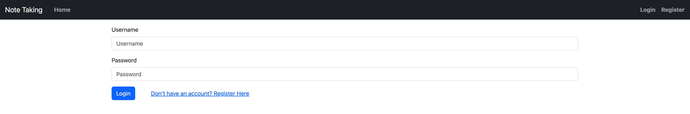
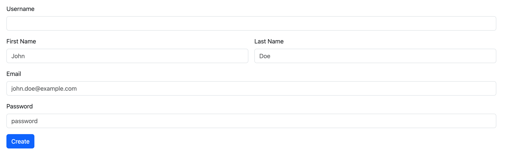
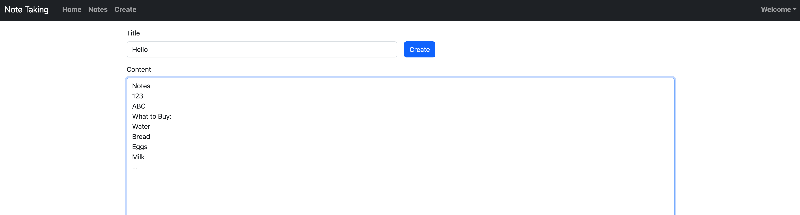
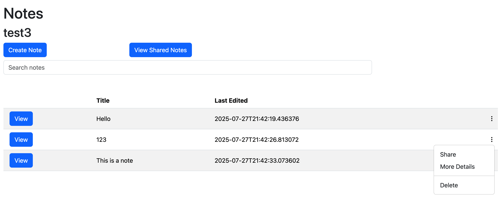
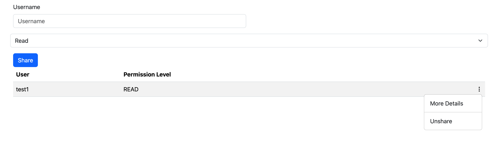
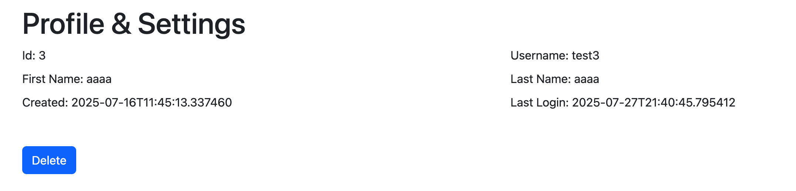
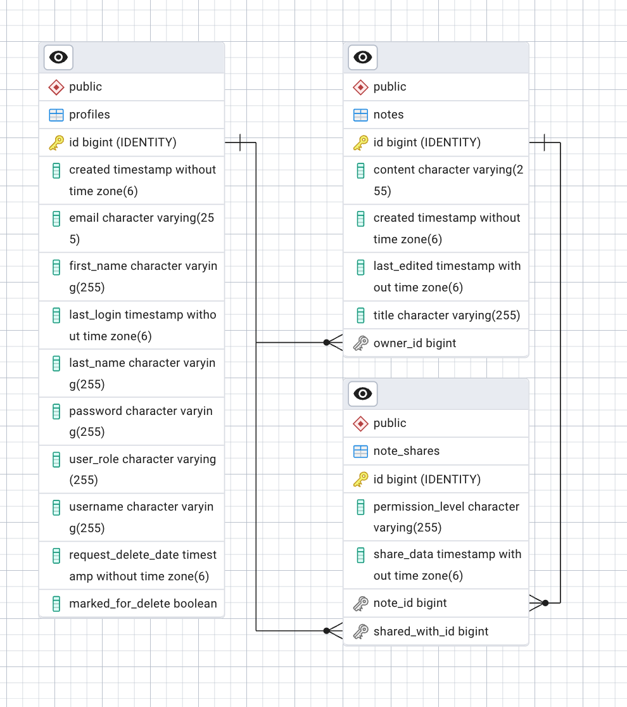

# springboot-notetaking

Basic Note taking app with the backend being created with Spring Boot. This project tries to follow Spring Boot's best practices and uses it's key concepts (IoC, DI, etc.). In addition it uses Thymeleaf for the templating and bootstrap for the frontend. It uses Postgresql for it's database.

## Features
You can login and register an account
You are able to writ, edit, and delete notes
You are able to search notes by title and/or contetn
You are able to share notes (Currently only read permission but it is expandable)

Some front-end related things are not implemented mainly due to this being learning about spring boot/back-end

## Images

